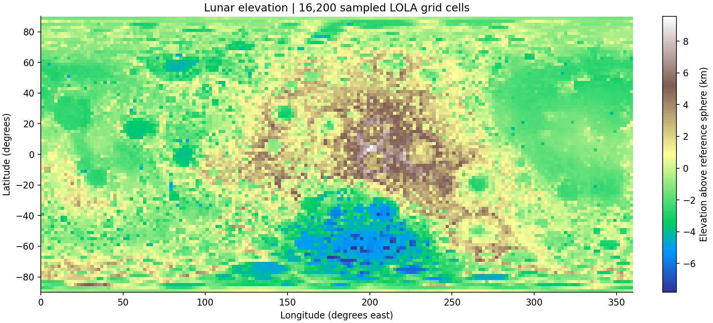
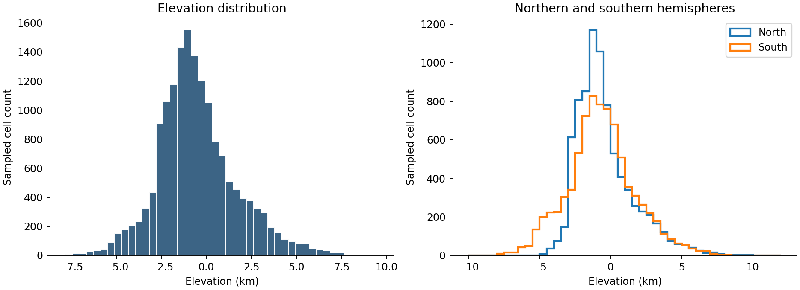

# Lunar Terrain Analysis

A small Python project that analyzes lunar elevation data and exports maps, charts, and summary tables. The default run samples **16,200 grid cells** from the Lunar Orbiter Laser Altimeter (LOLA) elevation model.



## What it does

- Reads the source label and checks the binary grid's size, format, and value range.
- Converts stored values to elevation in meters.
- Samples locations across the Moon and puts the results in a Pandas table.
- Compares elevation distributions in the northern and southern hemispheres.
- Saves CSV tables, a JSON summary, a short report, and two figures.

## Run it

Use Python 3.10 or newer. Open a terminal in this folder:

```bash
python -m venv .venv
```

Activate the environment on Windows PowerShell:

```powershell
.venv\Scripts\Activate.ps1
```

On macOS or Linux:

```bash
source .venv/bin/activate
```

Then install the packages and run the analysis:

```bash
python -m pip install -r requirements.txt
python analyze.py
```

The source files are included, so the default run does not need internet access after package installation. If the data files are missing, the script downloads them from the official archive. No API keys are needed.

To sample more cells:

```bash
python analyze.py --step 4 --output results_dense
```

This produces 64,800 sampled cells. A step of 1 processes all 1,036,800 cells and uses more memory. Each output folder is overwritten on rerun; use a different `--output` folder to keep a previous run.

## Data source

The input is **LDEM_4, version V3.0**, from the NASA LRO LOLA team, distributed through the [LOLA PDS archive at MIT](https://imbrium.mit.edu/).

- [Binary elevation grid](https://imbrium.mit.edu/DATA/LOLA_GDR/CYLINDRICAL/IMG/LDEM_4.IMG)
- [PDS label and conversion notes](https://imbrium.mit.edu/DATA/LOLA_GDR/CYLINDRICAL/IMG/LDEM_4.LBL)
- Dataset ID: `LRO-L-LOLA-4-GDR-V1.0`
- Product creation date: September 15, 2017
- Grid: 720 rows by 1,440 columns, at 4 pixels per degree

Credit for the measurements and elevation model belongs to the LRO LOLA science team. This repository contains an analysis of that existing data; it is not a NASA-affiliated research project. File hashes and download URLs are recorded in `results/provenance.json`.

## How the analysis works

The image is a little-endian signed 16-bit grid. The label gives a scale factor of 0.5, so `elevation_m = stored_value * 0.5`. Elevation is measured relative to a sphere with radius 1,737.4 km. The script does not add that radius to the elevation values.

The default samples every eighth row and column, starting near the middle of each eight-cell block. This gives a 90 by 180 sample, or 16,200 cells. Coordinates use the original pixel centers, north-to-south latitude ordering, and east-positive longitude from 0 to 360 degrees.

Pandas handles the table and hemisphere summaries. NumPy reads the binary data and calculates an area-weighted mean. Matplotlib generates the figures. JMARS is not required or used.

## Example results

The included default run gives:

| Measurement | Result |
| --- | ---: |
| Sampled cells | 16,200 |
| Lowest sampled elevation | -7,806.0 m |
| Highest sampled elevation | 9,548.5 m |
| Median sampled elevation | -806.0 m |
| Approximate area-weighted mean | -255.64 m |



The wide range shows substantial relief in the sampled terrain. The weighted mean differs from the ordinary cell mean because a latitude-longitude grid has smaller cells near the poles. Cosine latitude weights reduce that bias.

## Limitations

These are processed elevation grid cells, not 16,200 independent raw laser measurements. The source model can include interpolation and has documented band-edge artifacts. Sampling skips smaller terrain features, so the sample's minimum and maximum are not the Moon's absolute extremes.

The histograms and hemisphere tables count cells without area weighting. Only the explicitly named area-weighted mean uses cosine latitude weights. The map colors represent elevation, not water, vegetation, or surface composition. This project does not estimate mineral abundance, identify safe landing sites, or infer terrain slopes.

## Files

| File | Purpose |
| --- | --- |
| `analyze.py` | Download, validation, analysis, and plotting |
| `data/LDEM_4.IMG` | Original binary grid |
| `data/LDEM_4.LBL` | Original metadata and conversion rules |
| `results/sampled_elevation.csv` | Sample coordinates and elevations |
| `results/hemisphere_summary.csv` | North/south descriptive statistics |
| `results/summary.json` | Machine-readable results |
| `results/report.md` | Generated summary |
| `results/provenance.json` | Source URLs and SHA-256 hashes |
| `tests/test_analysis.py` | Checks for coordinates, units, sampling, and weighting |

## Tests

```bash
python -m unittest discover -s tests -v
```

## Possible next steps

Add a latitude/longitude filter for a regional study, compare different sampling steps, or inspect a selected region in a planetary GIS tool. The current scope is deliberately small so the full workflow is easy to run and explain.
